# Hot Block Architecture Prototype - Infrastructure
## Fleet manager - client side

Each client machine runs three cooperating programs that register with a central VPS, send periodic heartbeats, and execute commands issued by the server.


---

## Table of Contents

- [Overview](#overview)
- [Architecture](#architecture)
- [Project Structure](#project-structure)
- [Programs](#programs)
  - [main — Bootstrap](#main--bootstrap)
  - [heartbeat — UDP Keep-Alive](#heartbeat--udp-keep-alive)
  - [receiver — Command Executor](#receiver--command-executor)
- [Configuration](#configuration)
  - [Compile-time constants](#compile-time-constants)
  - [secrets/config.txt](#secretsconfigtxt)
- [Building](#building)
  - [Linux / macOS](#linux--macos)
  - [Windows (MinGW)](#windows-mingw)
  - [Windows (MSVC)](#windows-msvc)
- [Running](#running)
- [Command Protocol](#command-protocol)
  - [Commands reference](#commands-reference)
  - [File transfer protocol](#file-transfer-protocol)
- [Log Files](#log-files)

---

## Overview

Each client machine in the fleet runs the following three processes, all launched automatically by `main`:

| Process | Protocol | Purpose |
|---|---|---|
| `main` | TCP (once) | Registers with server, saves assigned port, spawns the other two |
| `heartbeat` | UDP | Sends a periodic pulse so the server knows the client is alive |
| `receiver` | TCP | Listens for commands from the server and executes them |

On first run, `main` generates a random 16-character alphanumeric client ID that permanently identifies this machine to the server. The ID and the server-assigned port are stored in `secrets/config.txt` and reused on every subsequent run.

---

## Architecture

```
root/
├── client-side/
│   ├── main.cpp          ← Bootstrap (compile to: main / main.exe)
│   ├── heartbeat.cpp     ← UDP heartbeat (compile to: heartbeat / heartbeat.exe)
│   ├── receiver.cpp      ← Command receiver (compile to: receiver / receiver.exe)
│   └── README.md
└── secrets/
    └── config.txt        ← Auto-generated on first run. DO NOT commit this file.
```

The `secrets/` directory sits one level above `client-side/` and is never part of the compiled binaries. It must be added to `.gitignore`.

---

## Project Structure

```
client-side/
├── main.cpp
├── heartbeat.cpp
├── receiver.cpp
└── README.md

../secrets/
└── config.txt
```

---

## Programs

### main — Bootstrap

**File:** `main.cpp`

The entry point for the entire client. Run this once to get everything started.

#### First run

1. Generates a random 16-character alphanumeric client ID (e.g. `aX3mK9qRvTpL2wYz`).
2. Opens a TCP connection to the server on the registration port (`8000` by default).
3. Sends `REGISTER <client_id>` to the server.
4. Waits for the server to reply with `PORT <number>`.
5. Saves the client ID, server IP, and assigned port to `../secrets/config.txt`.
6. Spawns `heartbeat` and `receiver` as independent child processes.

#### Subsequent runs

1. Reads `../secrets/config.txt`.
2. Skips registration entirely.
3. Spawns `heartbeat` and `receiver`.

#### Registration protocol

```
Client → "REGISTER <client_id>\n"
Server → "PORT <number>\n"       (success)
Server → "ERROR <reason>\n"      (failure)
```

---

### heartbeat — UDP Keep-Alive

**File:** `heartbeat.cpp`

Sends a small UDP datagram to the server at a fixed interval so the server's `heartbeat_monitor` can track which clients are online.

#### Behaviour

- Sends `HEARTBEAT seq=<n> ts=<timestamp>` to the server every `INTERVAL_SEC` seconds.
- On send failure, retries up to `MAX_RETRIES` times before logging an error and moving on.
- Reads the server IP and assigned port from `secrets/config.txt` (path passed as a command-line argument by `main`).
- Responds to `SIGINT` / `SIGTERM` (Ctrl+C) with a graceful shutdown.
- Logs all activity to both stdout and `heartbeat.log`.

#### Example packet payload

```
HEARTBEAT seq=42 ts=2026-03-23 10:15:30
```

---

### receiver — Command Executor

**File:** `receiver.cpp`

Binds a TCP socket to the client's assigned port and waits for commands from the server. Each incoming connection is handled in its own thread, so multiple commands can be queued without blocking.

#### Behaviour

- Reads the assigned port from `secrets/config.txt`.
- Binds to `0.0.0.0:<assigned_port>` and listens for incoming TCP connections.
- Uses `select()` with a 1-second timeout so the main loop can check for shutdown signals without blocking indefinitely.
- Responds to `SIGINT` / `SIGTERM` with a graceful shutdown.
- Logs all activity to both stdout and `receiver.log`.

---

## Configuration

### Compile-time constants

These are defined at the top of each source file and can be edited before compiling:

**`main.cpp`**

| Constant | Default | Description |
|---|---|---|
| `SERVER_IP` | `"72.60.221.128"` | VPS IP address |
| `REGISTER_PORT` | `8000` | TCP port the server listens on for registrations |
| `SECRETS_DIR` | `"../secrets"` | Directory where config is stored |
| `SECRETS_FILE` | `"../secrets/config.txt"` | Full path to the config file |
| `HEARTBEAT_BINARY` | `"./heartbeat"` | Path to the heartbeat executable |
| `RECEIVER_BINARY` | `"./receiver"` | Path to the receiver executable |
| `CLIENT_ID_LENGTH` | `16` | Length of the generated random client ID |

**`heartbeat.cpp`**

| Constant | Default | Description |
|---|---|---|
| `SERVER_PORT` | `9999` | UDP port on the server to send heartbeats to |
| `INTERVAL_SEC` | `5` | Seconds between each heartbeat |
| `MAX_RETRIES` | `3` | Send retry attempts before giving up |
| `LOG_FILE` | `"heartbeat.log"` | Log output file |

**`receiver.cpp`**

| Constant | Default | Description |
|---|---|---|
| `LOG_FILE` | `"receiver.log"` | Log output file |

---

### secrets/config.txt

Auto-generated by `main` on first run. Format:

```ini
# Auto-generated by main.cpp — do not edit manually
client_id=aX3mK9qRvTpL2wYz
server_ip=72.60.221.128
assigned_port=51042
```

| Key | Description |
|---|---|
| `client_id` | Permanent random ID for this machine |
| `server_ip` | The VPS IP address |
| `assigned_port` | The TCP/UDP port permanently assigned to this client by the server |

> **Important:** Add `secrets/` to your `.gitignore`. This file contains network topology information that should not be committed.

```gitignore
secrets/
```

---

## Building

All three programs require **C++17** and a compiler that supports `<filesystem>` (GCC 8+, Clang 7+, MSVC 2017+).

### Linux / macOS

```bash
g++ -std=c++17 -o main      main.cpp      -pthread
g++ -std=c++17 -o heartbeat heartbeat.cpp -pthread
g++ -std=c++17 -o receiver  receiver.cpp  -pthread
```

### Windows (MinGW)

```bash
g++ -std=c++17 -o main.exe      main.cpp      -lws2_32
g++ -std=c++17 -o heartbeat.exe heartbeat.cpp -lws2_32
g++ -std=c++17 -o receiver.exe  receiver.cpp  -lws2_32 -pthread
```

### Windows (MSVC)

```bash
cl /EHsc /std:c++17 main.cpp      ws2_32.lib
cl /EHsc /std:c++17 heartbeat.cpp ws2_32.lib
cl /EHsc /std:c++17 receiver.cpp  ws2_32.lib
```

> **Note for IDE users (Visual Studio / Code::Blocks):** Make sure the C++ language standard is set to **C++17** in the project settings, otherwise `<filesystem>` will fail to compile.

---

## Running

Simply run `main` — it handles everything else automatically:

```bash
# Linux / macOS
./main

# Windows
main.exe
```

`main` will spawn `heartbeat` and `receiver` as separate processes. On Windows each gets its own console window (`CREATE_NEW_CONSOLE`). On Linux/macOS they are forked as background child processes.

To stop the client, send `SIGINT` to the receiver (Ctrl+C in its terminal), or issue a `STOP` command from the server. The heartbeat can be stopped the same way.

---

## Command Protocol

The server sends commands to the receiver over a **plain-text TCP connection**. Each connection carries exactly one command, and the receiver always replies with `OK` or `ERR <reason>` before closing the connection.

```
Server  →  "<COMMAND> [args...]\n"
Receiver →  "OK\n"  or  "ERR <reason>\n"
```

### Commands reference

#### `MOVE <src> <dst>`

Moves or renames a file on the client machine.

```
MOVE C:\Users\lab\old_name.txt C:\Users\lab\new_name.txt
MOVE /home/lab/old.txt /home/lab/new.txt
```

Response: `OK` or `ERR <reason>`

---

#### `DELETE <path>`

Deletes a file on the client machine.

```
DELETE C:\Users\lab\unwanted.txt
DELETE /tmp/unwanted.txt
```

Response: `OK` or `ERR <reason>`

---

#### `EXEC <command>`

Executes a shell command or binary on the client. On Windows, the command is wrapped in `cmd /C` so PATH resolution and `.exe` files work normally.

```
EXEC notepad.exe
EXEC python3 /home/lab/script.py
EXEC shutdown /s /t 0
```

Response: `OK` if the process exits with code 0, otherwise `ERR process exited with code <n>`

> **Note:** The command runs synchronously — the receiver waits for it to finish before replying. For long-running processes, use `EXEC` with backgrounding (`start` on Windows, `&` on Linux).

---

#### `SEND_FILE <local_path> <dest_ip> <dest_port>`

Instructs the client to push a local file to another machine (the server or another client) that is listening with `RECV_FILE`.

```
SEND_FILE /home/lab/report.pdf 72.60.221.128 9100
```

The receiver opens a new TCP connection to `<dest_ip>:<dest_port>`, sends a `FILE <filename> <size>` header line, then streams the raw file bytes. Response: `OK sent <n> bytes` or `ERR <reason>`

---

#### `RECV_FILE <save_dir>`

Instructs the client to receive a file that the server is about to push over the same TCP connection. The server must follow this command immediately with a `FILE <filename> <size>` header line and then the raw file bytes.

```
RECV_FILE /home/lab/incoming
```

The file is saved as `<save_dir>/<filename>`. The directory is created automatically if it does not exist. Response: `OK saved to <path>` or `ERR <reason>`

---

#### `STOP`

Gracefully shuts down the receiver process.

```
STOP
```

Response: `OK stopping` — the receiver closes its listen socket and exits cleanly.

---

### File transfer protocol

When `SEND_FILE` or `RECV_FILE` is used, the raw TCP stream looks like this:

```
"FILE report.pdf 204800\n"
<204800 bytes of raw binary data>
```

The header line is always `FILE <filename> <size_in_bytes>\n`. The filename must not contain spaces. The receiving side reads exactly `<size>` bytes after the header.

---

## Log Files

| File | Written by | Contents |
|---|---|---|
| `heartbeat.log` | `heartbeat` | Timestamp, sequence number, bytes sent, retry warnings |
| `receiver.log` | `receiver` | Incoming commands (`IN`), outgoing responses (`OUT`), file ops (`CMD`), errors |

All log entries follow this format:

```
[2026-03-23 10:15:30] [LEVEL] Message
```

Log levels used: `INFO`, `OK`, `WARN`, `ERROR`, `CMD`, `IN`, `OUT`

Logs are opened in append mode (`std::ios::app`) so they survive restarts.

---